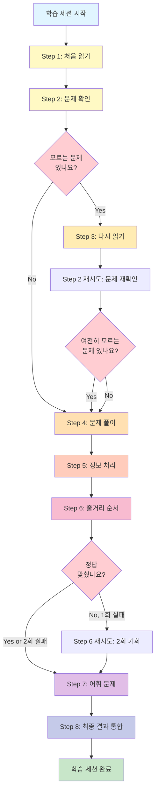

# 📖 읽쓰문해력 8단계 학습 프로세스 구조 분석

## 🎯 전체 구조 개요

```
사용자(user)
    ↓
강좌 선택(lecture)
    ↓
지문 선택(passage)
    ↓
학습 세션 생성(user_learning_session)
    ↓
┌─────────────────────────────────────────┐
│         8단계 순차 학습 프로세스           │
└─────────────────────────────────────────┘
    ↓
최종 결과 저장(step8_final_result)
```

---

## 📊 8단계 상세 흐름도


