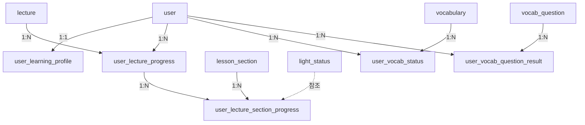
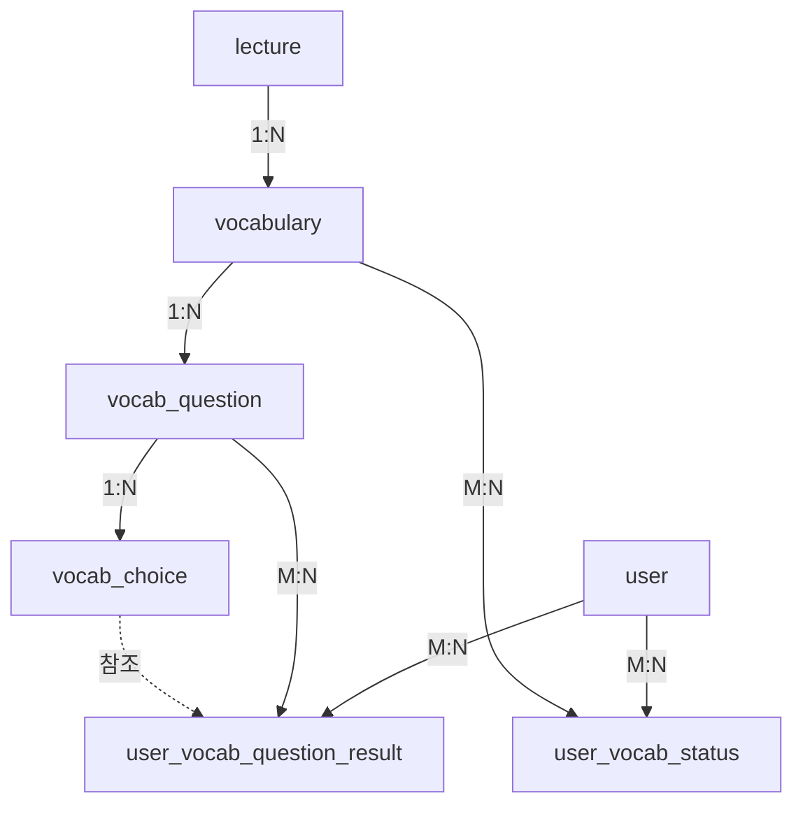

### 사용자 학습 추적 (User Learning Tracking)



### 어휘 학습 구조(Vocabulary Learning)



### 서술형 요약 구조 (Descriptive Summary)

````mermaid
    graph TD
    B[books] -->|N:1| DS[descript_summary]
    L[lecture] -->|N:1| DS

    DS -->|1:N| H[descript_summary_hint]

    U[user] -->|1:N| HR[user_descript_hint_response]
    H -->|1:N| HR

    U -->|1:N| SR[user_descript_summary_result]
    DS -->|1:N| SR

    U -->|1:N| SP[user_descript_summary_progress]
    B -->|1:N| SP
    L -->|1:N| SP
    ```
````
